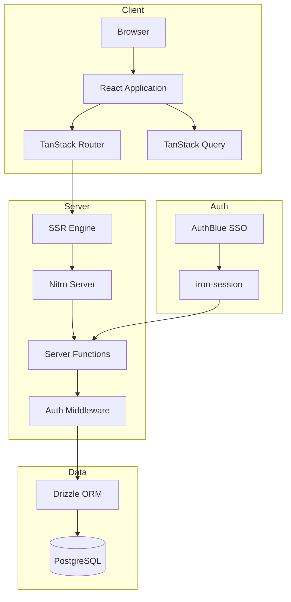
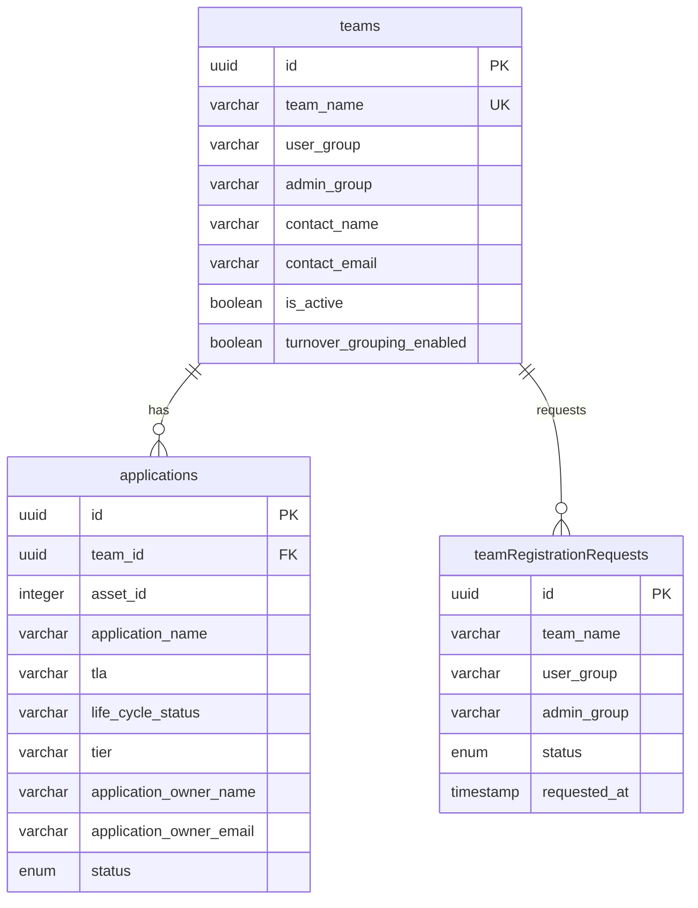
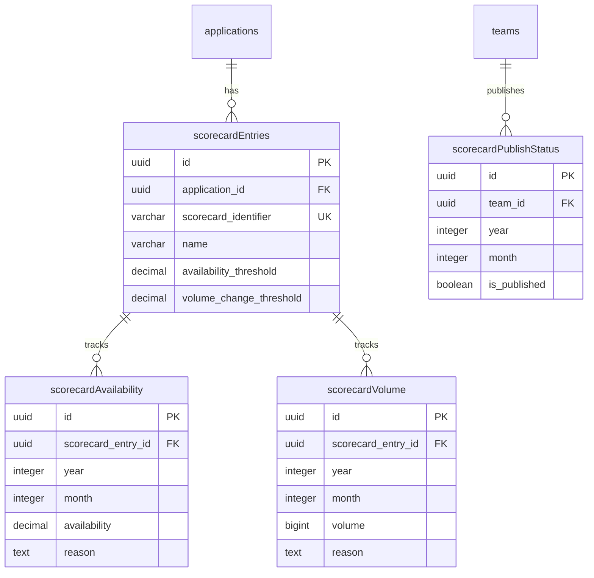
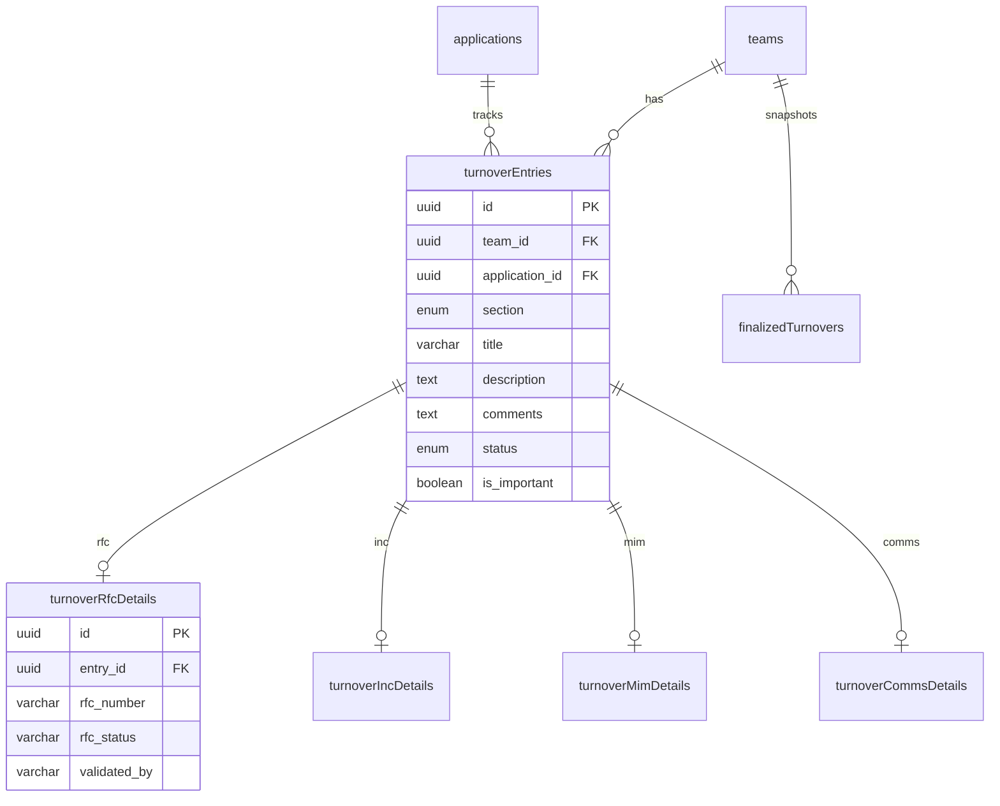
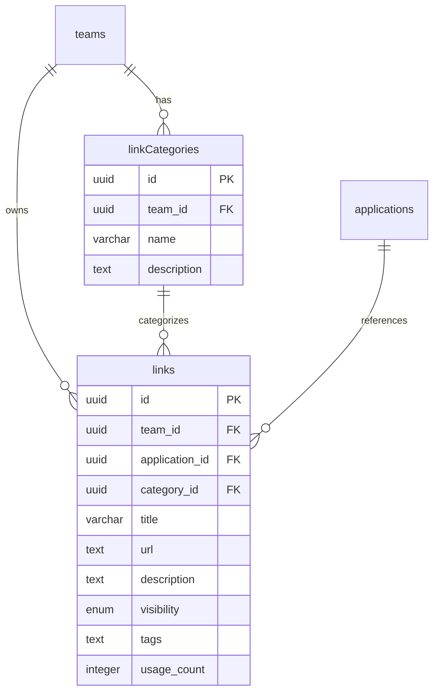
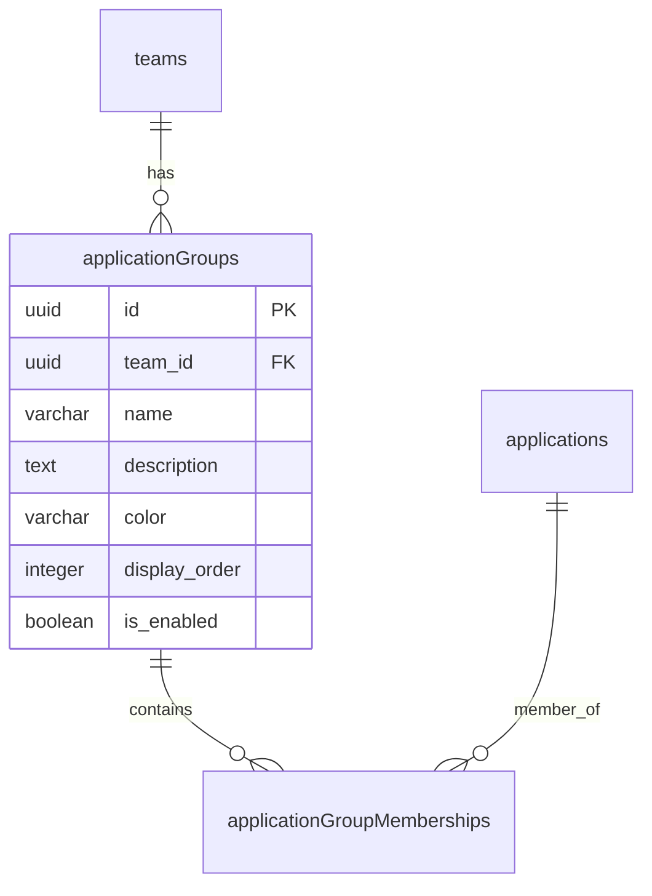
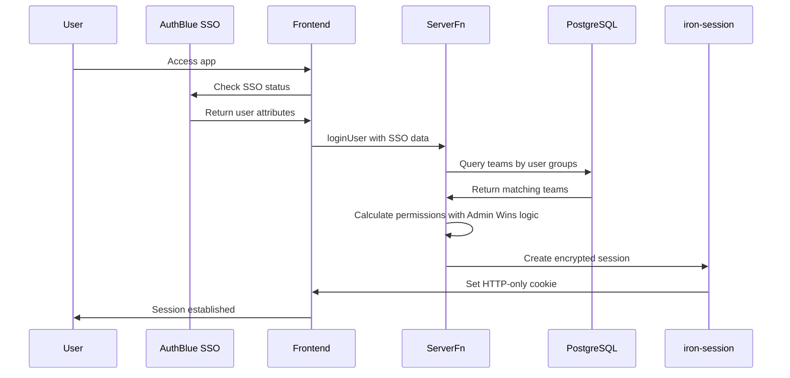

# Ensemble Platform - Codebase Analysis

## Executive Summary

Ensemble is a full-stack **Platform Operations** application built with modern TanStack technologies. It provides tools for tracking application performance metrics, managing shift handovers, and organizing documentation links for enterprise teams.

---

## Technology Stack

### Frontend

| Technology      | Version  | Purpose                             |
| --------------- | -------- | ----------------------------------- |
| React           | 19.2.0   | UI Framework                        |
| TanStack Router | 1.160.0  | File-based routing with type safety |
| TanStack Query  | 5.90.21  | Server state management             |
| TanStack Start  | 1.160.0  | Full-stack React framework with SSR |
| Tailwind CSS    | 4.0.6    | Styling                             |
| shadcn/ui       | 3.6.1    | Component library                   |
| Framer Motion   | 12.23.26 | Animations                          |
| Recharts        | 2.15.4   | Data visualization                  |
| Tiptap          | 3.15.3   | Rich text editing                   |
| dnd-kit         | 6.3.1    | Drag and drop                       |

### Backend

| Technology   | Purpose                      |
| ------------ | ---------------------------- |
| Nitro        | Server engine for SSR/API    |
| Drizzle ORM  | Database ORM                 |
| PostgreSQL   | Primary database             |
| iron-session | Encrypted session management |
| Zod          | Input validation             |

---

## Architecture Overview



---

## Database Schema

### Schema: `ensemble`

The application uses a custom PostgreSQL schema called `ensemble` to organize all tables.

### Core Tables

#### Teams & Applications



#### Scorecard Module



#### Turnover Module



#### Link Manager Module



#### Application Groups



---

## Application Features

### 1. Scorecard Metrics

**Purpose**: Track application availability and volume metrics on a monthly basis.

**Key Features**:

- Monthly availability percentage tracking per application/sub-application
- Volume metrics tracking with change threshold detection
- Configurable thresholds per entry
- Threshold breach highlighting with mandatory reason capture
- Year-over-year data visualization
- Enterprise-wide published scorecard view
- Chart visualizations with trend analysis

**Routes**:

- [`/teams/$teamId/scorecard`](src/routes/teams/$teamId/scorecard.tsx) - Team scorecard page
- [`/scorecard`](src/routes/scorecard.tsx) - Enterprise scorecard view

**Server Actions**:

- [`getScorecardData`](src/app/actions/scorecard.ts) - Fetch all scorecard data
- [`createScorecardEntry`](src/app/actions/scorecard.ts) - Create sub-application entry
- [`upsertAvailability`](src/app/actions/scorecard.ts) - Save availability data
- [`upsertVolume`](src/app/actions/scorecard.ts) - Save volume data
- [`publishScorecard`](src/app/actions/scorecard.ts) - Publish for enterprise view

---

### 2. Turnover Management

**Purpose**: Manage shift handovers with structured entry tracking.

**Entry Sections**:
| Section | Description | Special Fields |
|---------|-------------|----------------|
| RFC | Change requests | RFC Number, Status, Validated By |
| INC | Incidents | Incident Number |
| ALERTS | System alerts | - |
| MIM | Major Incident Management | MIM Link, Slack Link |
| COMMS | Communications | Email Subject, Slack Link |
| FYI | For Your Information | - |

**Key Features**:

- Create/edit/resolve entries with rich text comments
- Mark entries as important
- Group applications for organized viewing
- Drag-and-drop group management
- Finalize turnover snapshots
- Pass-the-baton workflow
- Transition history tracking
- Turnover metrics dashboard

**Routes**:

- [`/teams/$teamId/turnover/dispatch-turnover`](src/routes/teams/$teamId/turnover/dispatch-turnover.tsx) - Main turnover entry
- [`/teams/$teamId/turnover/pass-the-baton`](src/routes/teams/$teamId/turnover/pass-the-baton.tsx) - Handoff workflow
- [`/teams/$teamId/turnover/transition-history`](src/routes/teams/$teamId/turnover/transition-history.tsx) - History view
- [`/teams/$teamId/turnover/turnover-metrics`](src/routes/teams/$teamId/turnover/turnover-metrics.tsx) - Metrics dashboard

---

### 3. Link Manager

**Purpose**: Centralized repository for team documentation and links.

**Key Features**:

- Public and private link visibility
- Category-based organization
- Application-specific links
- Tag-based filtering
- Usage tracking with click counts
- Bulk import functionality
- Link statistics dashboard

**Routes**:

- [`/teams/$teamId/link-manager`](src/routes/teams/$teamId/link-manager/index.tsx) - Link list
- [`/teams/$teamId/link-manager/categories`](src/routes/teams/$teamId/link-manager/categories.tsx) - Category management
- [`/teams/$teamId/link-manager/import`](src/routes/teams/$teamId/link-manager/import.tsx) - Bulk import
- [`/teams/$teamId/link-manager/stats`](src/routes/teams/$teamId/link-manager/stats.tsx) - Statistics

---

### 4. Admin Panel

**Purpose**: System administration and team management.

**Key Features**:

- Team registration approval workflow
- Team management with application sync
- Health monitoring dashboard
- Request queue management

**Routes**:

- [`/admin`](src/routes/admin/index.tsx) - Admin dashboard
- [`/admin/teams`](src/routes/admin/teams.tsx) - Team management
- [`/admin/requests`](src/routes/admin/requests.tsx) - Registration requests
- [`/admin/health`](src/routes/admin/health.tsx) - System health

---

## Authentication & Authorization

### Authentication Flow



### Permission Model

```typescript
type TeamPermission = {
  teamId: string
  teamName: string
  role: 'ADMIN' | 'MEMBER'
}
```

**Permission Resolution Logic**:

1. Query teams where user's groups match `userGroup` OR `adminGroup`
2. Apply "Admin Wins" conflict resolution
3. Store permissions in encrypted session cookie

**Authorization Middleware**:

- [`requireAuth`](src/lib/middleware/auth.middleware.ts) - Ensures user is authenticated
- [`assertTeamMember`](src/lib/middleware/auth.middleware.ts) - Verifies team membership
- [`assertTeamAdmin`](src/lib/middleware/auth.middleware.ts) - Verifies admin role

---

## File Structure

```
src/
|-- app/
|   |-- actions/           # Server functions (API layer)
|   |   |-- application-groups.ts
|   |   |-- applications.ts
|   |   |-- health.ts
|   |   |-- links.ts
|   |   |-- scorecard.ts
|   |   |-- team-registration.ts
|   |   |-- teams.ts
|   |   |-- turnover.ts
|   |-- ssr/
|       |-- auth.ts        # SSR authentication functions
|-- components/
|   |-- ui/                # shadcn/ui components
|   |-- admin/             # Admin panel components
|   |-- enterprise-scorecard/
|   |-- landing/
|   |-- link-manager/
|   |-- scorecard/
|   |-- turnover/
|   |-- header.tsx         # Main navigation header
|   |-- session-guard.tsx  # Session initialization guard
|   |-- team-switcher.tsx  # Team context switcher
|-- db/
|   |-- index.ts           # Drizzle DB instance
|   |-- schema/            # Database schema definitions
|-- hooks/
|   |-- use-mobile.tsx     # Mobile detection hook
|-- lib/
|   |-- auth/              # Authentication configuration
|   |-- middleware/        # Server middleware
|   |-- zod/               # Zod validation schemas
|-- routes/                # TanStack Router file-based routes
|   |-- __root.tsx         # Root layout with session
|   |-- index.tsx          # Landing page
|   |-- admin/             # Admin routes
|   |-- teams/
|       |-- register.tsx   # Team registration
|       |-- $teamId/       # Team-specific routes
|-- router.tsx             # Router configuration
|-- routeTree.gen.ts       # Generated route tree
|-- styles.css             # Global styles
```

---

## Key Design Patterns

### 1. Server Functions with Middleware

```typescript
export const getScorecardData = createServerFn({ method: 'GET' })
  .middleware([requireAuth])
  .inputValidator((data) => GetScorecardDataSchema.parse(data))
  .handler(async ({ data, context }) => {
    // context.session available from middleware
    // data is validated by Zod
  })
```

### 2. Query Key Factory Pattern

The application follows TanStack Query best practices with structured query keys:

```typescript
// Implicit in useQuery calls
queryKey: ['scorecard', teamId, year]
queryKey: ['turnover-entries', teamId]
queryKey: ['links', teamId, filters]
```

### 3. Route Loaders with SSR

```typescript
export const Route = createFileRoute('/teams/$teamId/scorecard')({
  loader: async ({ params }) => {
    const team = await getTeamById({ data: { teamId: params.teamId } })
    return { team }
  },
  component: ScorecardPage,
})
```

### 4. Type-Safe Router Context

```typescript
export interface RouterContext {
  queryClient: QueryClient
  session: SessionData | null
}

// Available in all routes via useRouteContext
const { session } = useRouteContext({ from: '__root__' })
```

---

## Skills & Rules System

The project includes a comprehensive skills system for AI-assisted development:

### Available Skills

| Skill                  | Purpose                                 |
| ---------------------- | --------------------------------------- |
| `tanstack-query`       | React Query patterns and best practices |
| `tanstack-router`      | Routing patterns and type safety        |
| `tanstack-start`       | Server functions and SSR                |
| `tanstack-integration` | Combined Query + Router patterns        |
| `react-best-practices` | React component patterns                |
| `code-quality`         | General code quality rules              |

### Rule Categories

Each skill contains rules with priorities:

- **CRITICAL**: Must follow - prevents bugs/security issues
- **HIGH**: Strongly recommended - improves reliability
- **MEDIUM**: Good practice - enhances maintainability
- **LOW**: Nice to have - optimization

---

## Environment Configuration

Required environment variables:

- `DATABASE_URL` - PostgreSQL connection string
- `SESSION_PASSWORD` - 32+ character session encryption key

---

## Build & Deployment

### Scripts

| Command               | Purpose                         |
| --------------------- | ------------------------------- |
| `npm run dev`         | Development server on port 3000 |
| `npm run build`       | Production build                |
| `npm run start`       | Production server               |
| `npm run db:generate` | Generate Drizzle migrations     |
| `npm run db:push`     | Push schema to database         |

### Deployment

The application uses Nitro for server deployment with adapters available for various platforms. See [`DEPLOYMENT.md`](DEPLOYMENT.md) for detailed deployment instructions.

---

## Key Observations

### Strengths

1. **Type Safety**: Full end-to-end TypeScript with TanStack Router type registration
2. **Modern Stack**: Latest versions of React 19, TanStack libraries
3. **SSR Support**: Proper server-side rendering with session hydration
4. **Component Organization**: Well-structured component hierarchy by feature
5. **Validation**: Zod schemas for all server function inputs
6. **Database Design**: Proper relations, indexes, and constraints

### Areas for Consideration

1. **Large Files**: Some components exceed 500 lines (e.g., `header.tsx`, `metrics-chart-sheet.tsx`)
2. **Generated Route Tree**: `routeTree.gen.ts` is auto-generated and should not be edited
3. **Session Duration**: 1-day session expiry may need adjustment for enterprise use

---

## Summary

Ensemble is a well-architected enterprise platform operations application built with cutting-edge TanStack technologies. It provides three main functional modules (Scorecard, Turnover, Link Manager) with proper authentication, authorization, and data persistence. The codebase follows modern React and TypeScript best practices with a clear separation of concerns between server functions, components, and database schema.
