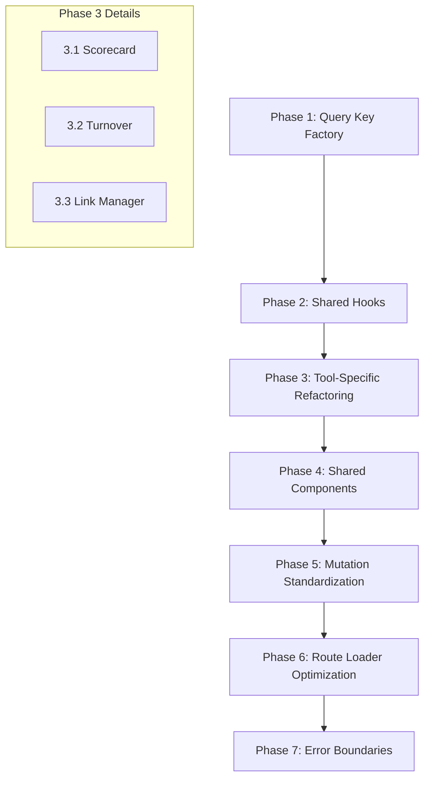

# Ensemble Platform - Refactoring Plan

## Overview

This plan outlines a systematic approach to refactor the Ensemble Platform codebase following the skills/rules defined in the project. The refactoring is organized into phases, targeting each tool (Scorecard, Turnover, Link Manager) and shared logic.

---

## Skills Applied

| Skill                  | Priority | Focus Areas                                               |
| ---------------------- | -------- | --------------------------------------------------------- |
| `code-quality`         | CRITICAL | DRY, file size, naming, function design                   |
| `react-best-practices` | CRITICAL | Hook extraction, component architecture, state management |
| `tanstack-query`       | CRITICAL | Query key factory, caching, mutations                     |
| `tanstack-router`      | HIGH     | Type safety, loaders, search params                       |
| `tanstack-start`       | HIGH     | Server functions, middleware, validation                  |
| `tanstack-integration` | HIGH     | Data flow, SSR coordination                               |

---

## Phase 1: Foundation - Query Key Factory

**Priority**: CRITICAL  
**Skill**: `tanstack-query/qk-factory-pattern`  
**Impact**: All three tools benefit immediately

### Current Problem

Query keys are scattered across 58+ locations with inconsistent naming:

```typescript
// Inconsistent patterns found:
;['teams'][('scorecard', teamId)][('turnover-entries', teamId)][ // Missing context // No hierarchical structure // Different naming convention
  ('links', teamId, search, visibility)
][('ldap-members', adminGroup)] // Inline dependencies // Not namespaced
```

### Target Structure

Create [`src/lib/query-keys.ts`](src/lib/query-keys.ts) with factory pattern:

```typescript
// Scorecard keys
export const scorecardKeys = {
  all: ['scorecard'] as const,
  team: (teamId: string) => [...scorecardKeys.all, teamId] as const,
  year: (teamId: string, year: number) =>
    [...scorecardKeys.team(teamId), year] as const,
  publishStatus: (teamId: string, year: number) =>
    [...scorecardKeys.team(teamId), 'publish-status', year] as const,
}

// Turnover keys
export const turnoverKeys = {
  all: ['turnover'] as const,
  team: (teamId: string) => [...turnoverKeys.all, teamId] as const,
  entries: (teamId: string, filters?: TurnoverFilters) =>
    [...turnoverKeys.team(teamId), 'entries', filters] as const,
  dispatch: (teamId: string) =>
    [...turnoverKeys.team(teamId), 'dispatch'] as const,
  finalized: (teamId: string, dateRange?: DateRange) =>
    [...turnoverKeys.team(teamId), 'finalized', dateRange] as const,
  metrics: (teamId: string, dateRange?: DateRange) =>
    [...turnoverKeys.team(teamId), 'metrics', dateRange] as const,
  groups: (teamId: string) => [...turnoverKeys.team(teamId), 'groups'] as const,
}

// Link keys
export const linkKeys = {
  all: ['links'] as const,
  team: (teamId: string) => [...linkKeys.all, teamId] as const,
  list: (teamId: string, filters: LinkFilters) =>
    [...linkKeys.team(teamId), 'list', filters] as const,
  categories: (teamId: string) =>
    [...linkKeys.team(teamId), 'categories'] as const,
  stats: (teamId: string) => [...linkKeys.team(teamId), 'stats'] as const,
}

// Team keys
export const teamKeys = {
  all: ['teams'] as const,
  list: () => [...teamKeys.all, 'list'] as const,
  detail: (teamId: string) => [...teamKeys.all, teamId] as const,
  applications: (teamId: string) =>
    [...teamKeys.detail(teamId), 'applications'] as const,
  ldap: (group: string) => [...teamKeys.all, 'ldap', group] as const,
}

// Admin keys
export const adminKeys = {
  all: ['admin'] as const,
  registrationRequests: () =>
    [...adminKeys.all, 'registration-requests'] as const,
  health: () => [...adminKeys.all, 'health'] as const,
}
```

### Files to Modify

| File                                          | Changes                     |
| --------------------------------------------- | --------------------------- |
| `src/routes/teams/$teamId/scorecard.tsx`      | Replace 8 query key usages  |
| `src/routes/teams/$teamId/turnover/*.tsx`     | Replace 12 query key usages |
| `src/routes/teams/$teamId/link-manager/*.tsx` | Replace 10 query key usages |
| `src/routes/admin/*.tsx`                      | Replace 5 query key usages  |
| `src/components/scorecard/*.tsx`              | Replace 4 query key usages  |
| `src/components/turnover/*.tsx`               | Replace 8 query key usages  |
| `src/components/link-manager/*.tsx`           | Replace 6 query key usages  |

---

## Phase 2: Shared Hooks Extraction

**Priority**: CRITICAL  
**Skill**: `react-best-practices/hook-extract-logic`  
**Impact**: Reduces component complexity, enables reuse

### 2.1 Shared Pagination Hook

**File**: [`src/hooks/use-pagination.ts`](src/hooks/use-pagination.ts)

```typescript
interface UsePaginationOptions<T> {
  items: T[]
  pageSize?: number
  initialPage?: number
}

interface UsePaginationReturn<T> {
  page: number
  setPage: (page: number) => void
  totalPages: number
  paginatedItems: T[]
  hasNext: boolean
  hasPrev: boolean
  nextPage: () => void
  prevPage: () => void
}

export function usePagination<T>({
  items,
  pageSize = 20,
  initialPage = 1,
}: UsePaginationOptions<T>): UsePaginationReturn<T>
```

**Used in**:

- `src/routes/teams/$teamId/turnover/transition-history.tsx`
- `src/routes/admin/requests.tsx`
- `src/routes/admin/teams.tsx`

### 2.2 Shared Search/Filter Hook

**File**: [`src/hooks/use-search-filter.ts`](src/hooks/use-search-filter.ts)

```typescript
interface UseSearchFilterOptions<T> {
  items: T[]
  searchFields: (keyof T)[]
  debounceMs?: number
}

interface UseSearchFilterReturn<T> {
  searchTerm: string
  setSearchTerm: (term: string) => void
  debouncedSearch: string
  filteredItems: T[]
}

export function useSearchFilter<T>({
  items,
  searchFields,
  debounceMs = 300,
}: UseSearchFilterOptions<T>): UseSearchFilterReturn<T>
```

**Used in**:

- `src/routes/teams/$teamId/link-manager/index.tsx`
- `src/routes/teams/$teamId/turnover/dispatch-turnover.tsx`
- `src/routes/teams/$teamId/turnover/transition-history.tsx`
- `src/routes/admin/teams.tsx`
- `src/routes/admin/requests.tsx`

### 2.3 Shared Expand/Collapse State Hook

**File**: [`src/hooks/use-expand-state.ts`](src/hooks/use-expand-state.ts)

```typescript
interface UseExpandStateOptions {
  initialExpanded?: Set<string>
}

interface UseExpandStateReturn {
  expanded: Set<string>
  isExpanded: (id: string) => boolean
  toggle: (id: string) => void
  expand: (id: string) => void
  collapse: (id: string) => void
  expandAll: (ids: string[]) => void
  collapseAll: () => void
  allExpanded: boolean
}

export function useExpandState(
  options?: UseExpandStateOptions,
): UseExpandStateReturn
```

**Used in**:

- `src/routes/teams/$teamId/scorecard.tsx` (expandedApps)
- `src/routes/scorecard.tsx` (expandedTeams, expandedApps)
- `src/routes/teams/$teamId/turnover/dispatch-turnover.tsx` (expandedApps)
- `src/routes/admin/health.tsx` (expandedCards)

### 2.4 Shared Date Range Hook

**File**: [`src/hooks/use-date-range.ts`](src/hooks/use-date-range.ts)

```typescript
interface UseDateRangeOptions {
  defaultDays?: number
}

interface UseDateRangeReturn {
  dateRange: DateRange | undefined
  setDateRange: (range: DateRange | undefined) => void
  presetRange: '7d' | '30d' | '90d' | 'custom'
  setPresetRange: (preset: '7d' | '30d' | '90d') => void
}

export function useDateRange(options?: UseDateRangeOptions): UseDateRangeReturn
```

**Used in**:

- `src/routes/teams/$teamId/turnover/turnover-metrics.tsx`
- `src/routes/teams/$teamId/turnover/transition-history.tsx`

---

## Phase 3: Tool-Specific Refactoring

### 3.1 Scorecard Tool

**Priority**: HIGH  
**Files**: Large files to split

#### 3.1.1 Split [`src/routes/teams/$teamId/scorecard.tsx`](src/routes/teams/$teamId/scorecard.tsx)

**Current**: ~900 lines  
**Target**: ~200 lines (orchestrator)

**Extract to**:

- [`src/components/scorecard/scorecard-header.tsx`](src/components/scorecard/scorecard-header.tsx) - Header with year/period selectors
- [`src/components/scorecard/scorecard-filters.tsx`](src/components/scorecard/scorecard-filters.tsx) - View mode and period filters
- [`src/components/scorecard/publish-dialog.tsx`](src/components/scorecard/publish-dialog.tsx) - Publish/unpublish dialog
- [`src/hooks/use-scorecard-data.ts`](src/hooks/use-scorecard-data.ts) - Data fetching and caching logic

#### 3.1.2 Split [`src/components/scorecard/metrics-chart-sheet.tsx`](src/components/scorecard/metrics-chart-sheet.tsx)

**Current**: ~1400 lines  
**Target**: ~300 lines

**Extract to**:

- [`src/components/scorecard/chart-controls.tsx`](src/components/scorecard/chart-controls.tsx) - Chart type/metric selectors
- [`src/components/scorecard/chart-legend.tsx`](src/components/scorecard/chart-legend.tsx) - Legend component
- [`src/components/scorecard/chart-renderer.tsx`](src/components/scorecard/chart-renderer.tsx) - Chart rendering logic
- [`src/hooks/use-chart-data.ts`](src/hooks/use-chart-data.ts) - Data transformation for charts

#### 3.1.3 Create Scorecard Query Options

**File**: [`src/lib/query-options/scorecard.ts`](src/lib/query-options/scorecard.ts)

```typescript
import { queryOptions } from '@tanstack/react-query'
import { scorecardKeys } from '@/lib/query-keys'
import { getScorecardData, getPublishStatus } from '@/app/actions/scorecard'

export const scorecardQueries = {
  data: (teamId: string, year: number) =>
    queryOptions({
      queryKey: scorecardKeys.year(teamId, year),
      queryFn: () => getScorecardData({ data: { teamId, year } }),
      staleTime: 1000 * 60 * 5, // 5 minutes
    }),
  publishStatus: (teamId: string, year: number) =>
    queryOptions({
      queryKey: scorecardKeys.publishStatus(teamId, year),
      queryFn: () => getPublishStatus({ data: { teamId, year } }),
      staleTime: 1000 * 60 * 10, // 10 minutes
    }),
}
```

---

### 3.2 Turnover Tool

**Priority**: HIGH

#### 3.2.1 Split [`src/routes/teams/$teamId/settings.tsx`](src/routes/teams/$teamId/settings.tsx)

**Current**: ~2500 lines (CRITICAL)  
**Target**: ~300 lines

**Extract to**:

- [`src/components/settings/team-overview.tsx`](src/components/settings/team-overview.tsx) - Team info section
- [`src/components/settings/applications-list.tsx`](src/components/settings/applications-list.tsx) - Applications management
- [`src/components/settings/application-dialog.tsx`](src/components/settings/application-dialog.tsx) - Add/edit application dialog
- [`src/components/settings/ldap-members.tsx`](src/components/settings/ldap-members.tsx) - LDAP group management
- [`src/hooks/use-team-settings.ts`](src/hooks/use-team-settings.ts) - Settings state management

#### 3.2.2 Split [`src/components/turnover/entry-dialog.tsx`](src/components/turnover/entry-dialog.tsx)

**Current**: ~1000 lines  
**Target**: ~200 lines

**Extract to**:

- [`src/components/turnover/rfc-form.tsx`](src/components/turnover/rfc-form.tsx) - RFC-specific fields
- [`src/components/turnover/inc-form.tsx`](src/components/turnover/inc-form.tsx) - Incident-specific fields
- [`src/components/turnover/mim-form.tsx`](src/components/turnover/mim-form.tsx) - MIM-specific fields
- [`src/components/turnover/comms-form.tsx`](src/components/turnover/comms-form.tsx) - Communications-specific fields
- [`src/components/turnover/section-form-router.tsx`](src/components/turnover/section-form-router.tsx) - Routes to correct form

#### 3.2.3 Split [`src/components/turnover/entry-card.tsx`](src/components/turnover/entry-card.tsx)

**Current**: ~1000 lines  
**Target**: ~150 lines

**Extract to**:

- [`src/components/turnover/entry-header.tsx`](src/components/turnover/entry-header.tsx) - Card header with actions
- [`src/components/turnover/entry-content.tsx`](src/components/turnover/entry-content.tsx) - Main content display
- [`src/components/turnover/entry-actions.tsx`](src/components/turnover/entry-actions.tsx) - Action buttons
- [`src/components/turnover/entry-dialogs.tsx`](src/components/turnover/entry-dialogs.tsx) - Delete/resolve dialogs

#### 3.2.4 Create Turnover Query Options

**File**: [`src/lib/query-options/turnover.ts`](src/lib/query-options/turnover.ts)

```typescript
import { queryOptions, infiniteQueryOptions } from '@tanstack/react-query'
import { turnoverKeys } from '@/lib/query-keys'

export const turnoverQueries = {
  entries: (teamId: string, filters?: TurnoverFilters) =>
    queryOptions({
      queryKey: turnoverKeys.entries(teamId, filters),
      queryFn: () => getTurnoverEntries({ data: { teamId, ...filters } }),
      staleTime: 1000 * 30, // 30 seconds (frequently changing)
    }),
  dispatch: (teamId: string) =>
    queryOptions({
      queryKey: turnoverKeys.dispatch(teamId),
      queryFn: () => getDispatchEntries({ data: { teamId } }),
      staleTime: 0, // Always fresh
    }),
  groups: (teamId: string) =>
    queryOptions({
      queryKey: turnoverKeys.groups(teamId),
      queryFn: () => getApplicationGroups({ data: { teamId } }),
      staleTime: 1000 * 60 * 60, // 1 hour (rarely changes)
    }),
}
```

---

### 3.3 Link Manager Tool

**Priority**: HIGH

#### 3.3.1 Split [`src/routes/teams/$teamId/link-manager/import.tsx`](src/routes/teams/$teamId/link-manager/import.tsx)

**Current**: ~1400 lines  
**Target**: ~200 lines

**Extract to**:

- [`src/components/link-manager/import-input-step.tsx`](src/components/link-manager/import-input-step.tsx) - Input parsing step
- [`src/components/link-manager/import-review-step.tsx`](src/components/link-manager/import-review-step.tsx) - Review/edit step
- [`src/components/link-manager/import-format-selector.tsx`](src/components/link-manager/import-format-selector.tsx) - Format selection
- [`src/hooks/use-link-import.ts`](src/hooks/use-link-import.ts) - Import parsing logic

#### 3.3.2 Split [`src/components/link-manager/link-views.tsx`](src/components/link-manager/link-views.tsx)

**Current**: ~700 lines  
**Target**: ~100 lines (router only)

**Extract to**:

- [`src/components/link-manager/link-grid-view.tsx`](src/components/link-manager/link-grid-view.tsx) - Grid view
- [`src/components/link-manager/link-table-view.tsx`](src/components/link-manager/link-table-view.tsx) - Table view
- [`src/components/link-manager/link-compact-view.tsx`](src/components/link-manager/link-compact-view.tsx) - Compact view

#### 3.3.3 Create Link Query Options

**File**: [`src/lib/query-options/links.ts`](src/lib/query-options/links.ts)

```typescript
import { infiniteQueryOptions } from '@tanstack/react-query'
import { linkKeys } from '@/lib/query-keys'

export const linkQueries = {
  list: (teamId: string, filters: LinkFilters) =>
    infiniteQueryOptions({
      queryKey: linkKeys.list(teamId, filters),
      queryFn: ({ pageParam }) =>
        getLinks({
          data: { teamId, ...filters, cursor: pageParam },
        }),
      initialPageParam: undefined as string | undefined,
      getNextPageParam: (lastPage) => lastPage.nextCursor,
      staleTime: 1000 * 60 * 2, // 2 minutes
    }),
  categories: (teamId: string) =>
    queryOptions({
      queryKey: linkKeys.categories(teamId),
      queryFn: () => getLinkCategories({ data: { teamId } }),
      staleTime: 1000 * 60 * 30, // 30 minutes
    }),
}
```

---

## Phase 4: Shared Component Extraction

**Priority**: MEDIUM  
**Skill**: `code-quality/dry-component-patterns`

### 4.1 Shared Stats Card Component

**Current**: Multiple implementations across tools

**File**: [`src/components/shared/stats-card.tsx`](src/components/shared/stats-card.tsx)

```typescript
interface StatsCardProps {
  title: string
  value: string | number
  description?: string
  icon: LucideIcon
  trend?: { value: number; label: string }
  className?: string
}

export function StatsCard({
  title,
  value,
  description,
  icon,
  trend,
  className,
}: StatsCardProps)
```

**Used in**:

- `src/components/scorecard/stats-card.tsx`
- `src/components/enterprise-scorecard/stats-summary.tsx`
- `src/routes/admin/index.tsx`

### 4.2 Shared Empty State Component

**File**: [`src/components/shared/empty-state.tsx`](src/components/shared/empty-state.tsx)

```typescript
interface EmptyStateProps {
  icon: LucideIcon
  title: string
  description: string
  action?: {
    label: string
    onClick: () => void
  }
}

export function EmptyState({
  icon,
  title,
  description,
  action,
}: EmptyStateProps)
```

**Used in**:

- All three tools have similar empty states

### 4.3 Shared Loading Skeleton Component

**File**: [`src/components/shared/loading-skeleton.tsx`](src/components/shared/loading-skeleton.tsx)

```typescript
interface LoadingSkeletonProps {
  variant: 'card' | 'list' | 'table' | 'detail'
  count?: number
}

export function LoadingSkeleton({ variant, count = 3 }: LoadingSkeletonProps)
```

---

## Phase 5: Mutation Standardization

**Priority**: HIGH  
**Skill**: `tanstack-query/mut-invalidate-queries`

### 5.1 Create Mutation Helpers

**File**: [`src/lib/mutation-helpers.ts`](src/lib/mutation-helpers.ts)

```typescript
import { queryClient } from '@/lib/query-client'
import {
  scorecardKeys,
  turnoverKeys,
  linkKeys,
  teamKeys,
} from '@/lib/query-keys'

// Standard invalidation patterns
export const invalidateAfterMutation = {
  scorecard: {
    all: (teamId: string) =>
      queryClient.invalidateQueries({
        queryKey: scorecardKeys.team(teamId),
      }),
    year: (teamId: string, year: number) =>
      queryClient.invalidateQueries({
        queryKey: scorecardKeys.year(teamId, year),
      }),
    publishStatus: (teamId: string, year: number) =>
      queryClient.invalidateQueries({
        queryKey: scorecardKeys.publishStatus(teamId, year),
      }),
  },
  turnover: {
    all: (teamId: string) =>
      queryClient.invalidateQueries({
        queryKey: turnoverKeys.team(teamId),
      }),
    entries: (teamId: string) =>
      queryClient.invalidateQueries({
        queryKey: turnoverKeys.entries(teamId),
      }),
    groups: (teamId: string) =>
      queryClient.invalidateQueries({
        queryKey: turnoverKeys.groups(teamId),
      }),
  },
  links: {
    all: (teamId: string) =>
      queryClient.invalidateQueries({
        queryKey: linkKeys.team(teamId),
      }),
    list: (teamId: string) =>
      queryClient.invalidateQueries({
        queryKey: linkKeys.team(teamId),
      }),
    categories: (teamId: string) =>
      queryClient.invalidateQueries({
        queryKey: linkKeys.categories(teamId),
      }),
  },
  teams: {
    all: () => queryClient.invalidateQueries({ queryKey: teamKeys.all }),
    applications: (teamId: string) =>
      queryClient.invalidateQueries({
        queryKey: teamKeys.applications(teamId),
      }),
  },
}
```

### 5.2 Standardize Mutation Patterns

Replace all inline `queryClient.invalidateQueries` calls with helper functions:

```typescript
// Before (found 30+ times):
onSuccess: () => {
  queryClient.invalidateQueries({ queryKey: ['scorecard', teamId] })
  toast.success('Entry saved')
}

// After:
import { invalidateAfterMutation } from '@/lib/mutation-helpers'

onSuccess: () => {
  invalidateAfterMutation.scorecard.all(teamId)
  toast.success('Entry saved')
}
```

---

## Phase 6: Route Loader Optimization

**Priority**: MEDIUM  
**Skill**: `tanstack-router/load-ensure-query-data`

### 6.1 Convert to Loader Pattern

Currently many routes use `useQuery` in components. Convert to loaders with `ensureQueryData`:

**Example - Scorecard Route**:

```typescript
// Before: useQuery in component
const { data: currentYearData } = useQuery({
  queryKey: ['scorecard', teamId, currentYear],
  queryFn: () => getScorecardData({ data: { teamId, year: currentYear } }),
})

// After: loader with ensureQueryData
import { scorecardQueries } from '@/lib/query-options/scorecard'

export const Route = createFileRoute('/teams/$teamId/scorecard')({
  loader: async ({ context, params }) => {
    const { queryClient } = context
    const currentYear = new Date().getFullYear()

    // Parallel loading
    const [team, scorecardData, publishStatus] = await Promise.all([
      getTeamById({ data: { teamId: params.teamId } }),
      queryClient.ensureQueryData(
        scorecardQueries.data(params.teamId, currentYear),
      ),
      queryClient.ensureQueryData(
        scorecardQueries.publishStatus(params.teamId, currentYear),
      ),
    ])

    return { team, scorecardData, publishStatus }
  },
  component: ScorecardPage,
})
```

---

## Phase 7: Error Boundary Implementation

**Priority**: MEDIUM  
**Skill**: `react-best-practices/err-boundaries`

### 7.1 Create Tool Error Boundaries

**File**: [`src/components/error-boundaries/tool-error-boundary.tsx`](src/components/error-boundaries/tool-error-boundary.tsx)

```typescript
import { ErrorBoundary } from 'react-error-boundary'
import { useQueryErrorResetBoundary } from '@tanstack/react-query'

interface ToolErrorBoundaryProps {
  children: React.ReactNode
  toolName: 'scorecard' | 'turnover' | 'link-manager'
}

export function ToolErrorBoundary({ children, toolName }: ToolErrorBoundaryProps) {
  const { reset } = useQueryErrorResetBoundary()

  return (
    <ErrorBoundary
      onReset={reset}
      fallbackRender={({ error, resetErrorBoundary }) => (
        <ToolErrorFallback
          error={error}
          onRetry={resetErrorBoundary}
          toolName={toolName}
        />
      )}
    >
      {children}
    </ErrorBoundary>
  )
}
```

### 7.2 Wrap Tool Routes

```typescript
// In each tool's route file
function ScorecardPage() {
  return (
    <ToolErrorBoundary toolName="scorecard">
      <ScorecardContent />
    </ToolErrorBoundary>
  )
}
```

---

## Implementation Order



### Recommended Execution Order

| Phase                        | Duration   | Dependencies  |
| ---------------------------- | ---------- | ------------- |
| 1. Query Key Factory         | 1 session  | None          |
| 2. Shared Hooks              | 1 session  | Phase 1       |
| 3.1 Scorecard Refactoring    | 2 sessions | Phase 1, 2    |
| 3.2 Turnover Refactoring     | 2 sessions | Phase 1, 2    |
| 3.3 Link Manager Refactoring | 1 session  | Phase 1, 2    |
| 4. Shared Components         | 1 session  | Phase 3       |
| 5. Mutation Standardization  | 1 session  | Phase 1, 3    |
| 6. Route Loader Optimization | 1 session  | Phase 1, 3, 5 |
| 7. Error Boundaries          | 1 session  | Phase 3       |

---

## File Size Targets

After refactoring, all files should meet these targets:

| File Type        | Max Lines      | Action if Exceeded         |
| ---------------- | -------------- | -------------------------- |
| Route components | 200            | Extract to sub-components  |
| UI components    | 150            | Split by responsibility    |
| Hooks            | 100            | Compose from smaller hooks |
| Server actions   | 200 per domain | Split by entity            |
| Query options    | 100            | Split by domain            |

---

## Success Metrics

- [ ] All query keys use factory pattern
- [ ] No file exceeds 300 lines
- [ ] All shared logic extracted to hooks
- [ ] All mutations use standardized invalidation
- [ ] All tool routes have error boundaries
- [ ] All loaders use `ensureQueryData` pattern
- [ ] Zero `any` types in production code

---

## Next Steps

1. **Start with Phase 1** - Query Key Factory (highest impact, lowest risk)
2. Create the query keys file
3. Update one tool at a time to use the new keys
4. Verify each tool works before moving to the next
5. Proceed to Phase 2 once Phase 1 is complete

Would you like me to begin with Phase 1 implementation?
